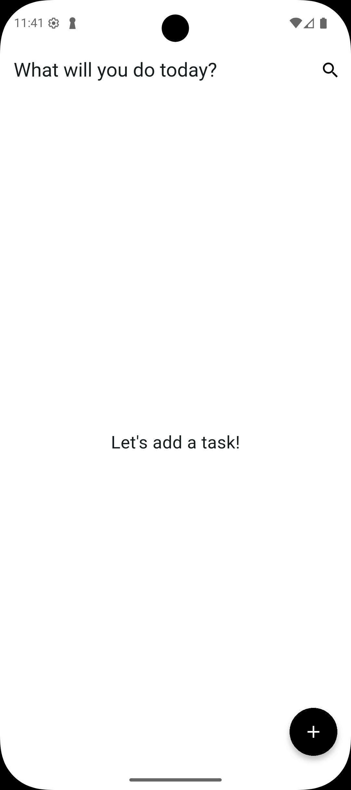
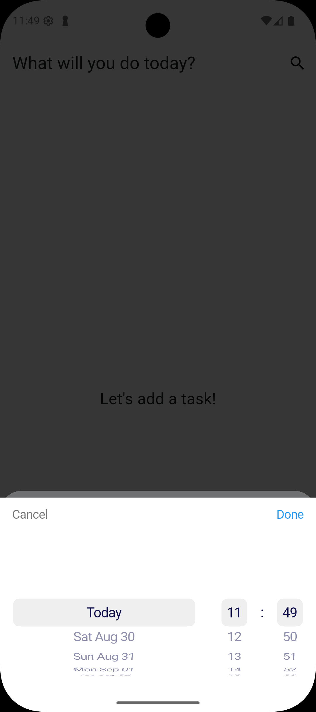
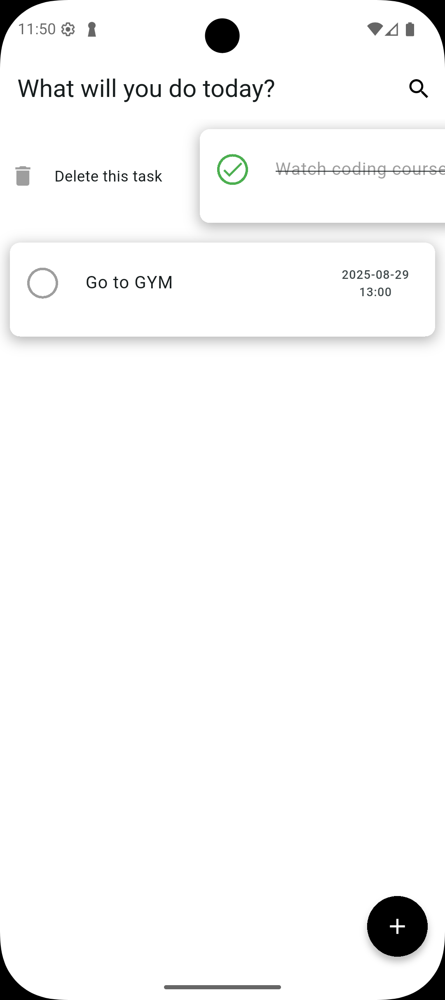
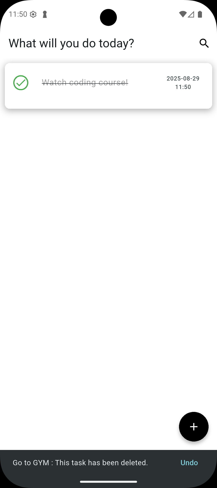
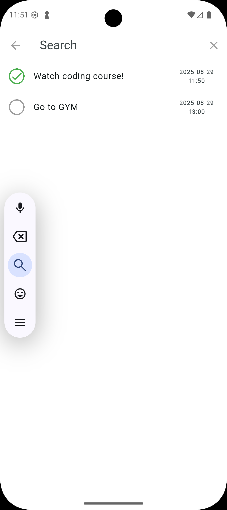
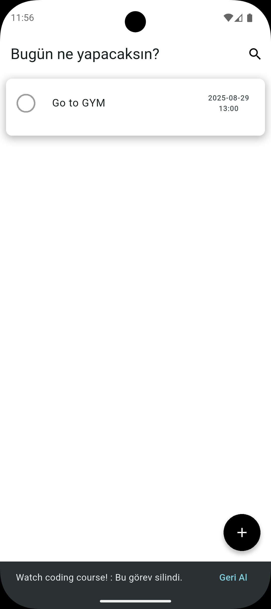
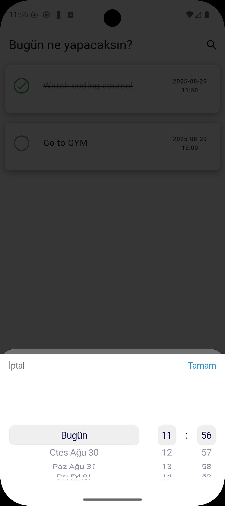
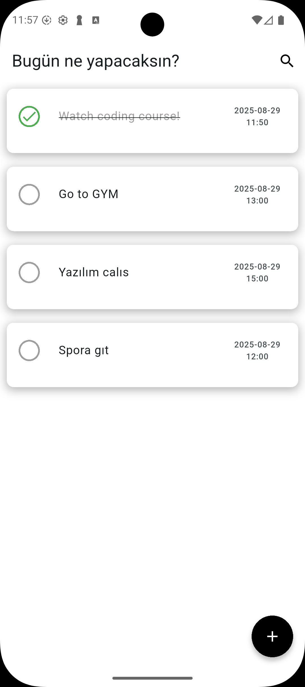
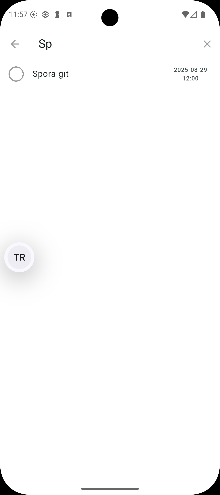
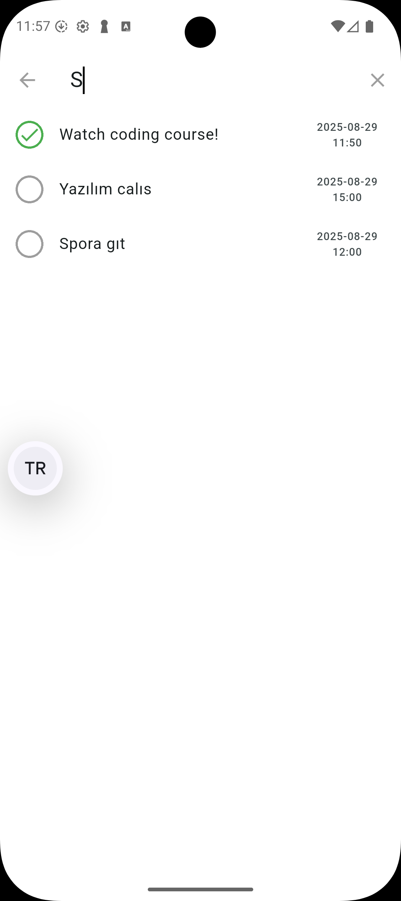

# ToDo App

<p align="right">
  <a href="README_EN.md">🇬🇧 English</a>
</p>

[](https://github.com/aliozdeemir/pokedex/actions/workflows/flutter-ci.yml) [](LICENSE)

[](https://github.com/aliozdeemir) [](https://www.linkedin.com/in/aoz-demir) [](mailto:aoz.demir@outlook.com)


Bu, Flutter ile geliştirilmiş, tam özellikli bir Todo uygulamasıdır. Uygulama, kullanıcıların görevleri oluşturmasına, yönetmesine ve takip etmesine olanak tanır, güzel bir kullanıcı arayüzü ve kullanıcı deneyimine odaklanmıştır.

## Özellikler

- **Görev Yönetimi**: Görev oluşturma, düzenleme, silme ve tamamlandı olarak işaretleme
- **Tarih ve Zaman**: Görevler için son tarih ve saat belirleme
- **Çoklu Dil Desteği**: İngilizce ve Türkçe dil seçenekleri
- **Yerel Depolama**: Görevler Hive veritabanı kullanılarak yerel olarak saklanır
- **Arama İşlevi**: Görevler arasında arama yapabilme
- **Duyarlı Tasarım**: Farklı ekran boyutlarına uyum sağlar

## Ekran Görüntüleri
<p>


















</p>

## Kullanılan Teknolojiler

- **Flutter**: UI çerçevesi
- **Hive**: Yerel depolama için NoSQL veritabanı
- **EasyLocalization**: Uluslararasılaştırma desteği için
- **flutter_screenutil**: Duyarlı kullanıcı arayüzü için
- **flutter_datetime_picker_plus**: Tarih ve saat seçimi için
- **GetIt**: Bağımlılık enjeksiyonu için servis bulucu

## Proje Yapısı

```
lib/
├── constants/
│   └── ui_helper.dart
├── data/
│   └── local_storage.dart
├── helper/
│   └── translations_helper.dart
├── models/
│   └── task_model.dart
├── view/
│   └── home_page.dart
├── widgets/
│   ├── custom_app_bar.dart
│   ├── custom_search_delegete.dart
│   └── task_list_item.dart
└── main.dart
```

## Başlangıç

### Ön Koşullar

- Flutter SDK
- Dart SDK
- Flutter eklentileri ile Android Studio / VS Code

### Kurulum

1. Depoyu klonlayın
```bash
git clone https://github.com/aliozdeemir/todo_app.git
```

2. Proje klasörüne gidin
```bash
cd todo_app
```

3. Bağımlılıkları yükleyin
```bash
flutter pub get
```

4. Uygulamayı çalıştırın
```bash
flutter run
```

## Kullanım

1. **Görev Ekleme**:
   - Kayan eylem düğmesine veya uygulama başlığına dokunun
   - Bir görev başlığı girin
   - Son tarih ve saati seçin
   - Kaydet'e dokunun

2. **Görevi Tamamlama**:
   - Görevin yanındaki daire simgesine dokunun

3. **Görevi Düzenleme**:
   - Görev başlığını doğrudan listede düzenleyin
   - Enter tuşuna basarak değişiklikleri gönderin

4. **Görevi Silme**:
   - Görevi soldan sağa kaydırın
   - Gerekirse SnackBar eylemiyle silme işlemini geri alın

5. **Görev Arama**:
   - Uygulama çubuğundaki arama simgesine dokunun
   - Arama sorgunuzu girin

## Lisans

Bu proje MIT Lisansı altında lisanslanmıştır - ayrıntılar için LICENSE dosyasına bakın.

## Teşekkürler

- Harika framework için Flutter ekibine
- Bu projeyi mümkün kılan tüm paket yazarlarına

## İletişim

<p>
	<a href="https://github.com/aliozdeemir"></a>
	<a href="https://www.linkedin.com/in/aoz-demir"></a>
	<a href="mailto:aoz.demir@outlook.com"></a>
</p>
