# ToDo App

<p align="left">
  <a href="README.md">TR Türkçe</a>
</p>

[](https://github.com/aliozdeemir/pokedex/actions/workflows/flutter-ci.yml) [](LICENSE)

[](https://github.com/aliozdeemir) [](https://www.linkedin.com/in/aoz-demir) [](mailto:aoz.demir@outlook.com)


This is a fully featured Todo application built with Flutter. The app allows users to create, manage, and track tasks, all with a beautiful UI and a focus on user experience.

## Features

- **Task Management**: Create, edit, delete and mark tasks as completed
- **Due Date and Time**: Set due date and time for tasks
- **Light/Dark Theme**: Switch between light and dark themes
- **Multilingual Support**: Available in English and Turkish
- **Local Storage**: Tasks are stored locally using Hive database
- **Search Functionality**: Search through your tasks
- **Responsive Design**: Adapts to different screen sizes

## Screenshots

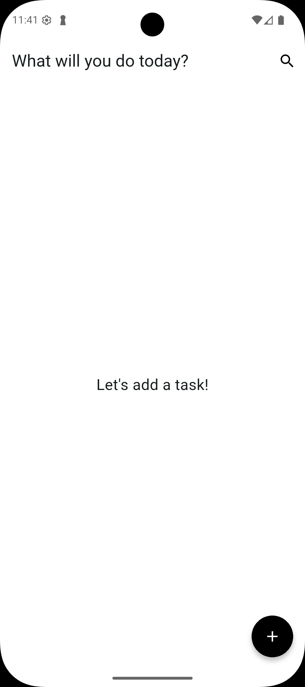
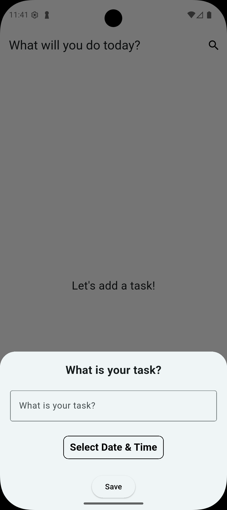
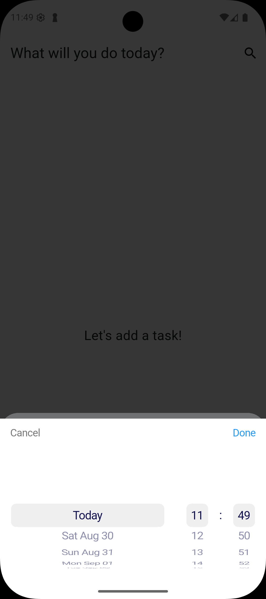
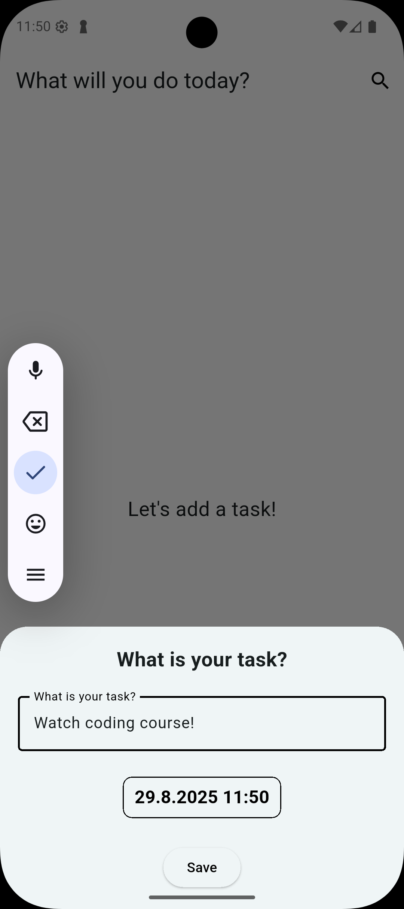
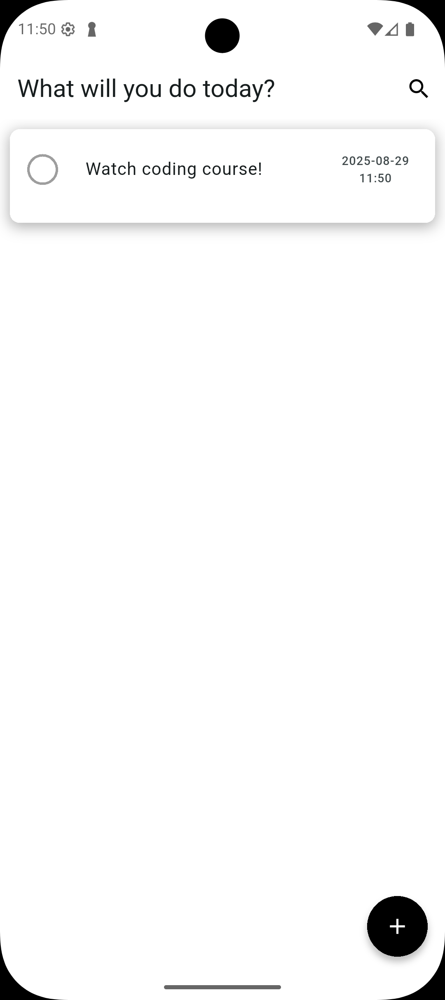
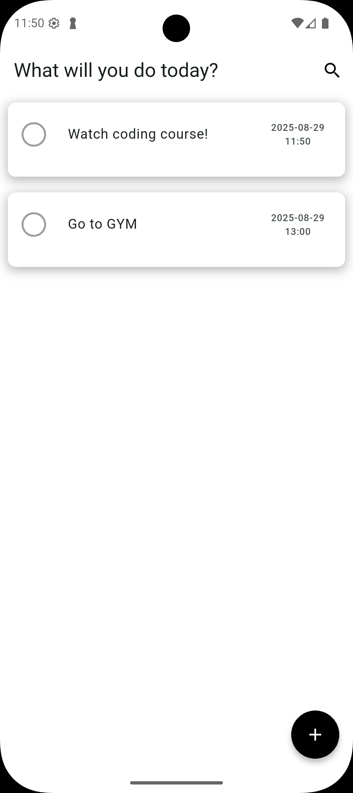
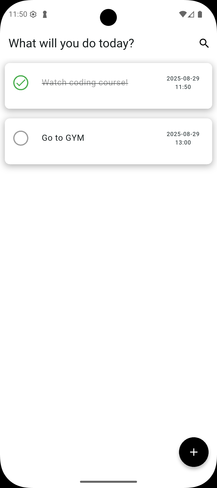
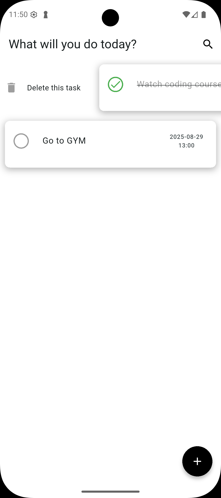
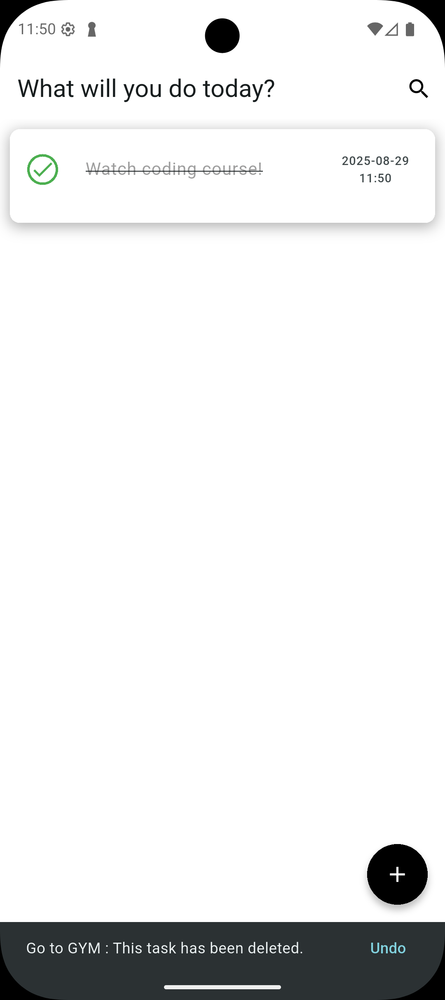
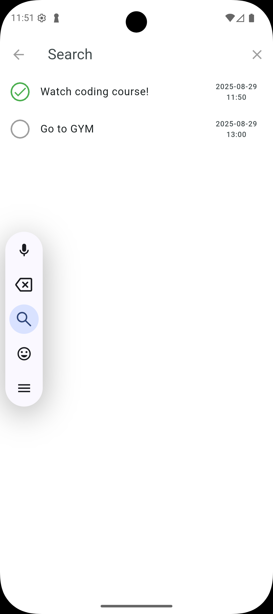
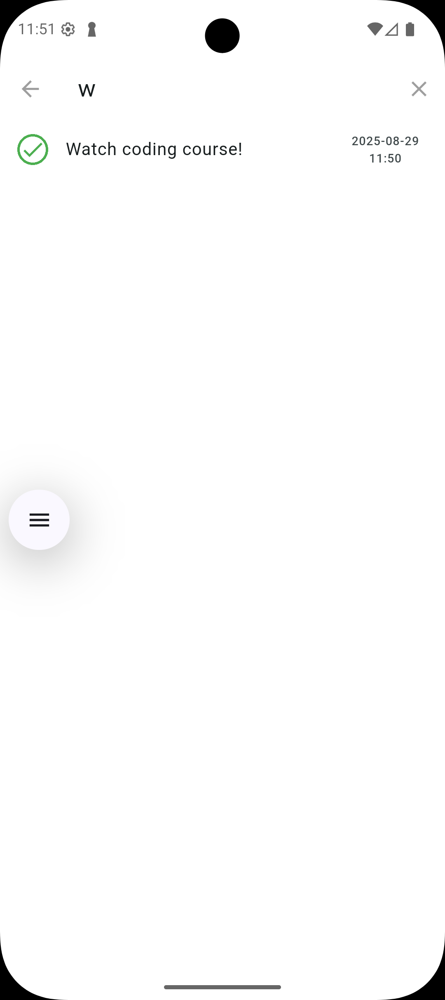
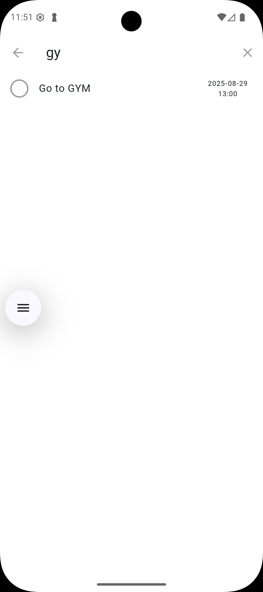
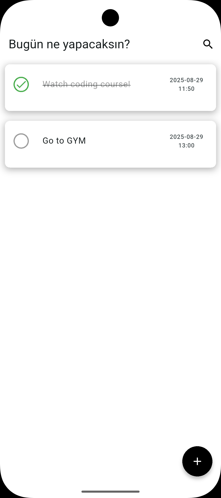
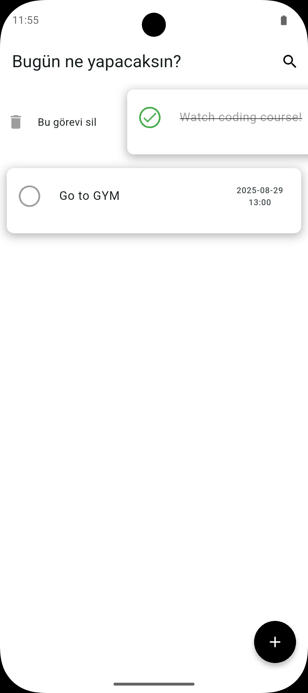
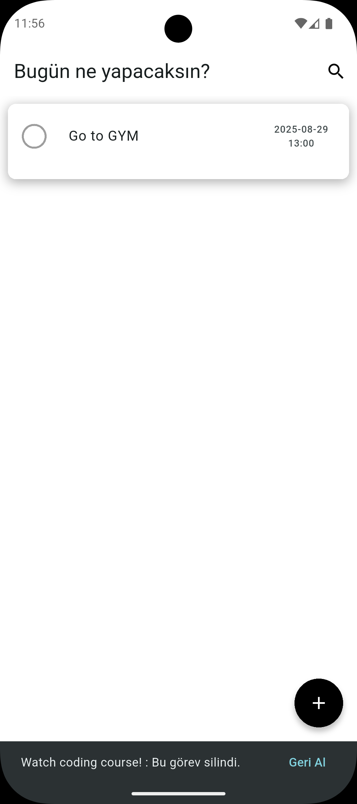
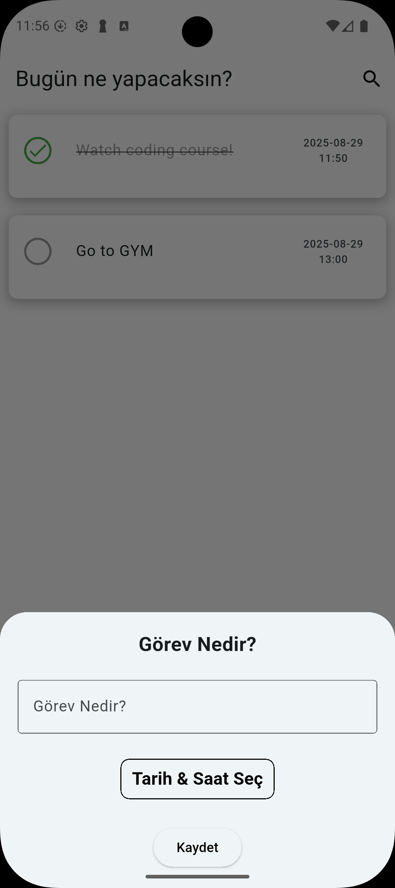
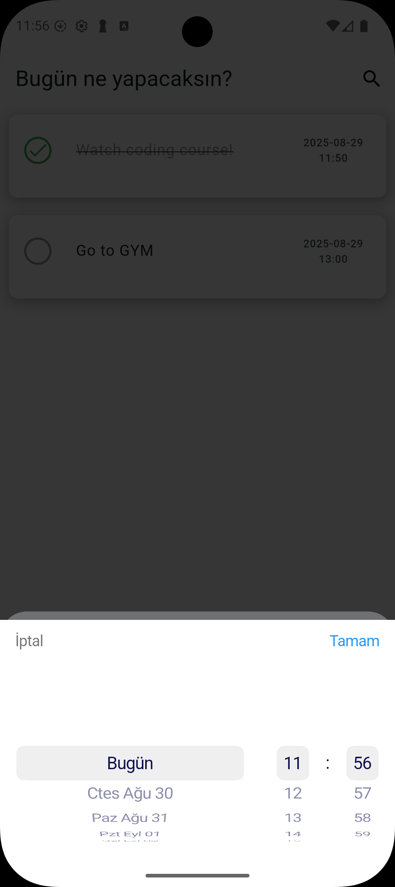

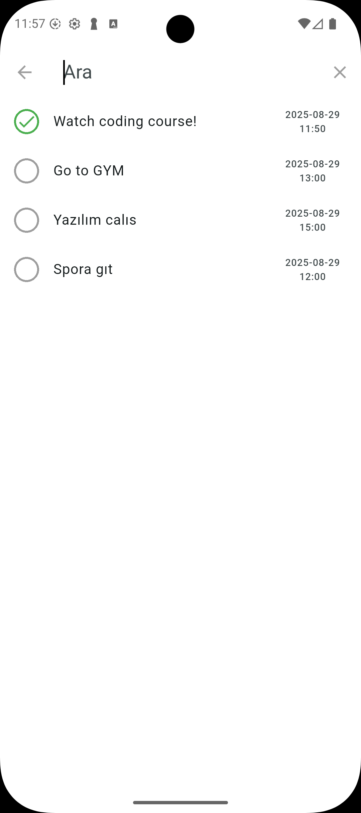
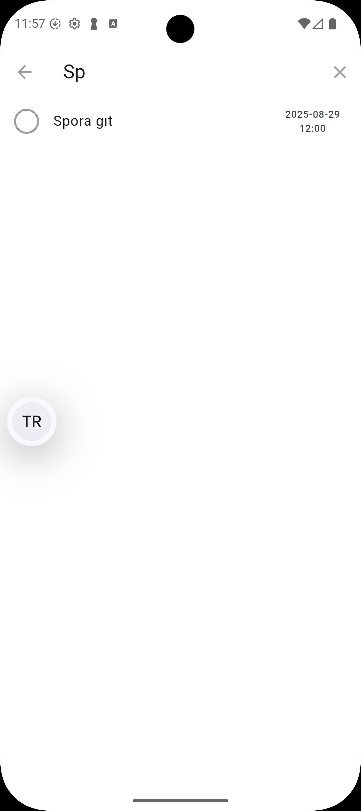
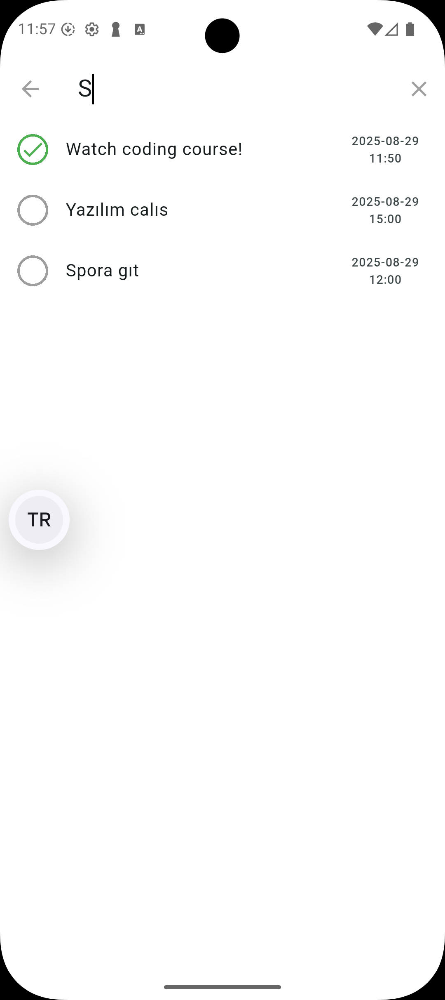
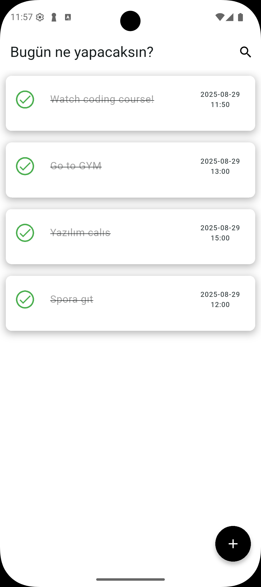

## Technologies Used

- **Flutter**: UI framework
- **Hive**: NoSQL database for local storage
- **EasyLocalization**: For internationalization support
- **flutter_screenutil**: For responsive UI
- **flutter_datetime_picker_plus**: For date and time selection
- **GetIt**: Service locator for dependency injection

## Project Structure

```
lib/
├── constants/
│   └── ui_helper.dart
├── data/
│   └── local_storage.dart
├── helper/
│   └── translations_helper.dart
├── models/
│   └── task_model.dart
├── view/
│   └── home_page.dart
├── widgets/
│   ├── custom_app_bar.dart
│   ├── custom_search_delegete.dart
│   └── task_list_item.dart
└── main.dart
```

## Getting Started

### Prerequisites

- Flutter SDK
- Dart SDK
- Android Studio / VS Code with Flutter plugins

### Installation

1. Clone the repository
```bash
git clone https://github.com/yourusername/todo_app.git
```

2. Navigate to the project folder
```bash
cd todo_app
```

3. Install dependencies
```bash
flutter pub get
```

4. Run the app
```bash
flutter run
```

## Usage

1. **Adding a Task**:
   - Tap on the floating action button or the app title
   - Enter a task title
   - Select a due date and time
   - Tap Save

2. **Completing a Task**:
   - Tap on the circle icon next to a task

3. **Editing a Task**:
   - Edit the task title directly in the list
   - Submit changes by pressing Enter

4. **Deleting a Task**:
   - Swipe the task from left to right
   - Undo deletion with the SnackBar action if needed

5. **Searching Tasks**:
   - Tap on the search icon in the app bar
   - Enter your search query

## License

This project is licensed under the MIT License - see the LICENSE file for details.

## Acknowledgements

- Flutter team for the amazing framework
- All the package authors that made this project possible

## Contact

<p>
	<a href="https://github.com/aliozdeemir"></a>
	<a href="https://www.linkedin.com/in/aoz-demir"></a>
	<a href="mailto:aoz.demir@outlook.com"></a>
</p>
